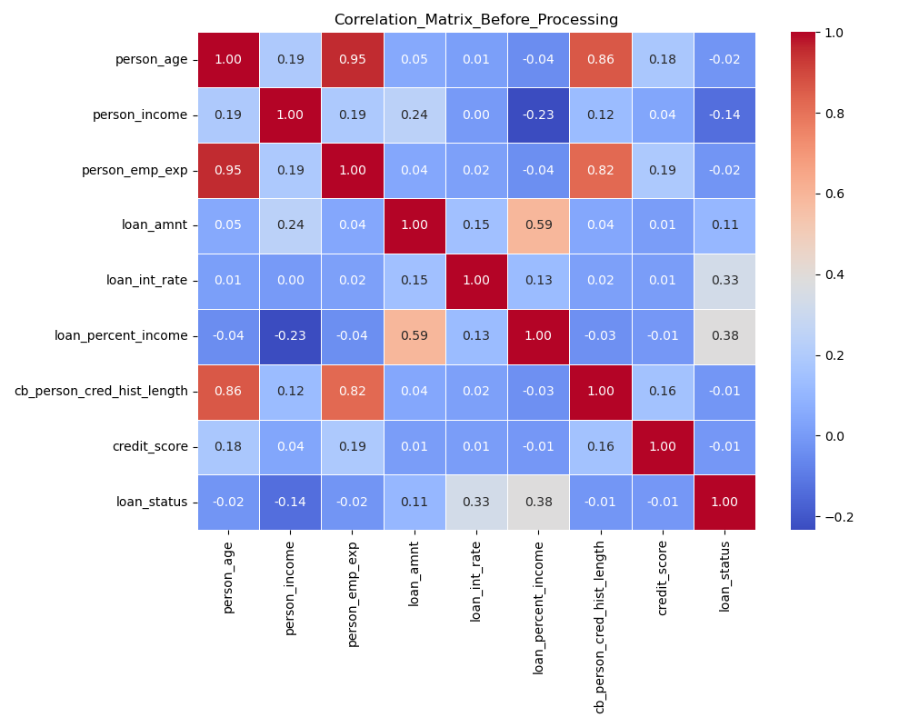
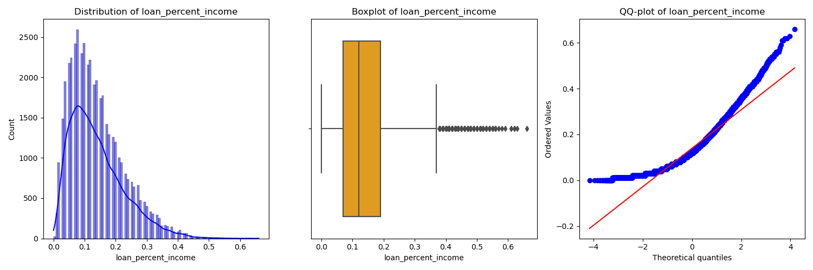
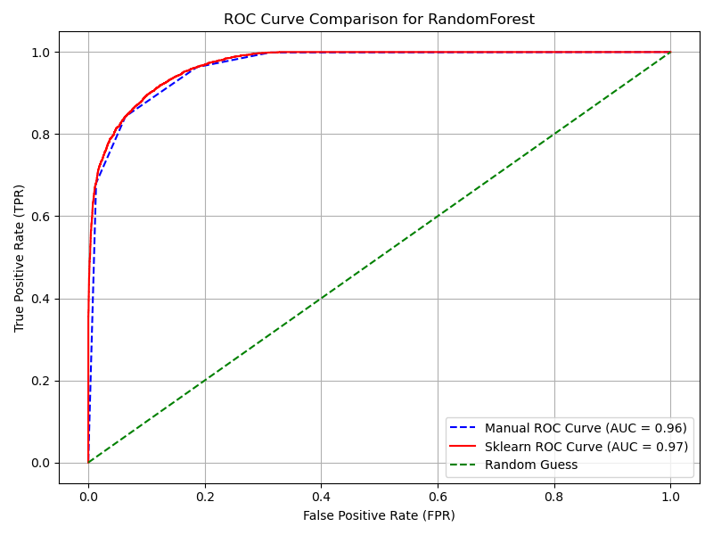
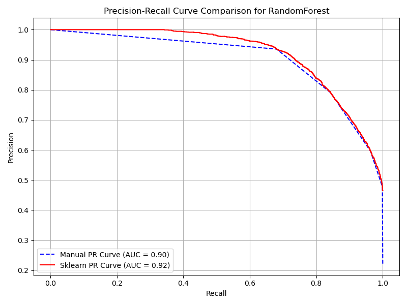

# LoanApproval 🚀

Welcome to the **LoanApproval Data Analysis and Prediction Pipeline**! This project focuses on analyzing data and predicting loan approvals using machine learning techniques. 🏦💻

---

## 📂 Project Structure

```
.
├── eda.py                 # Exploratory Data Analysis scripts
├── train_test.py          # Training and testing scripts for Random Forest model
├── data/
│   ├── data.csv           # Original dataset
│   ├── update_df.csv      # Processed dataset
├── eda/
│   ├── *.png              # EDA visualizations
├── results/
│   ├── results.json       # Model metrics
│   ├── *.png              # Evaluation plots
└── README.md              # Documentation
```

---

## 🔧 Setup Instructions

1. Install the required dependencies:
    ```bash
    pip install -r requirements.txt
    ```

2. Place your dataset (`data.csv`) in the `data/` folder.

3. Run the scripts for EDA and model training:
    - **EDA**: `python eda.py`
    - **Model Training**: `python train_test.py`

---

## 🔍 Exploratory Data Analysis (EDA)

### Features:
- Correlation Heatmaps 📊
- Boxplots for Outliers 🛠️
- Detailed Column Analysis:
  - Numerical Statistics 📈
  - Categorical Value Counts 🍰

### Example Outputs:
Correlation Matrix:


Histogram/Boxplot/QQ-Plot:


---

## 🤖 Machine Learning Pipeline

### Features:
- Preprocessing with StandardScaler and OneHotEncoder
- Train-Test Splitting
- Random Forest Classifier
- Performance Metrics:
  - **Accuracy**, **Precision**, **Recall**, **F1 Score**
  - **ROC-AUC** and **PR-AUC**

### Visual Outputs:
ROC Curve:


PR Curve:


---

## 📈 Example Results

Sample metrics for the Random Forest model:

```json
{
    "RandomForest": {
        "manual": {
            "Accuracy": "0.887",
            "Precision": "0.683",
            "Recall": "0.916",
            "F1": "0.783",
            "ROC-AUC": "0.964",
            "PR-AUC": "0.902"
        },
        "sklearn": {
            "Accuracy": "0.887",
            "Precision": "0.683",
            "Recall": "0.916",
            "F1": "0.783",
            "ROC-AUC": "0.971",
            "PR-AUC": "0.919"
        }
    }
}
```

---

## ✨ Highlights

- Fully automated **EDA** with visualizations saved in `eda/`.
- End-to-end model training with metrics and plots saved in `results/`.
- Simple and modular design for easy extension.

---

## 📝 License

This project is licensed under the MIT License. Feel free to use and adapt it. 🛠️